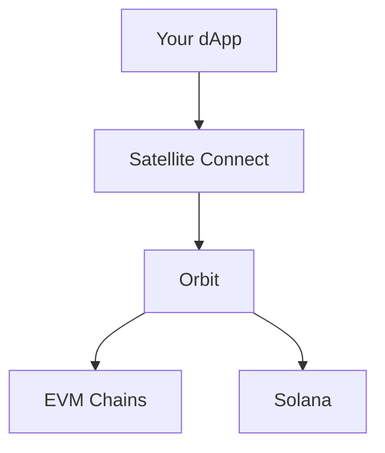

# Introduction

Welcome to Satellite Connect - a powerful Web3 ecosystem that brings together wallet connections and blockchain interactions in a unified, developer-friendly way.

## 🏛️ The TUWA Ecosystem

The TUWA ecosystem consists of two main product lines:

### 🛰️ Satellite Connect
Universal wallet connection system with multi-chain support:

#### Core Packages
- **@tuwaio/satellite-core** - Foundation with universal wallet interface
- **@tuwaio/satellite-react** - React components and hooks for wallet connection
  
#### Chain-Specific Adapters
- **@tuwaio/satellite-evm** - EVM wallet integrations
- **@tuwaio/satellite-solana** - Solana wallet support

### 🌍 Orbit
Framework-agnostic blockchain interaction libraries:

#### Core Components
- **@tuwaio/orbit-core** - Foundation for blockchain interactions
- **@tuwaio/orbit-evm** - EVM-specific utilities and helpers
- **@tuwaio/orbit-solana** - Solana-specific utilities and helpers

## ✨ Key Features

### Satellite Connect
- Universal wallet connection interface
- Multi-chain wallet support (EVM + Solana)
- Mobile-ready with universal links
- React 19+ integration

### Orbit
- Chain-agnostic operations
- Type-safe development
- Framework independence
- Optimized performance

## 🔗 How They Work Together

Satellite Connect uses Orbit as its foundation for blockchain interactions:



- **Satellite Connect** handles wallet connections and user interactions
- **Orbit** provides the underlying blockchain interaction layer
- Together they offer a complete solution for Web3 development

## 💾 Getting Started

```bash
# Install Satellite Connect components
pnpm add @tuwaio/satellite-core @tuwaio/satellite-react

# Add chain-specific adapters
pnpm add @tuwaio/satellite-evm @tuwaio/satellite-solana

# Install Orbit components
pnpm add @tuwaio/orbit-core @tuwaio/orbit-evm @tuwaio/orbit-solana
```

## 📚 Next Steps

In progress

**Built with ❤️ by the [TUWA Team](https://github.com/TuwaIO)**